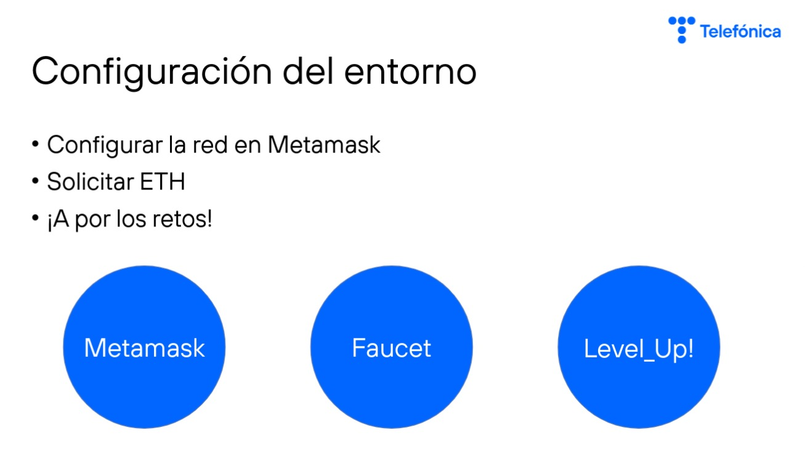
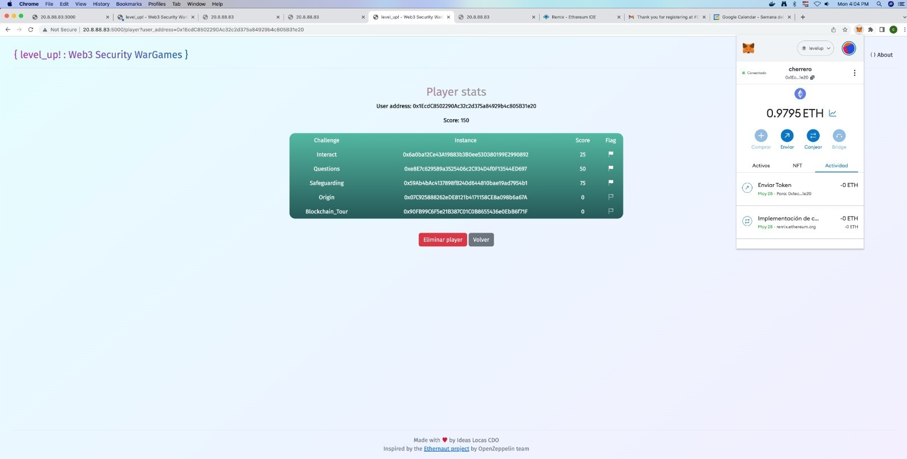
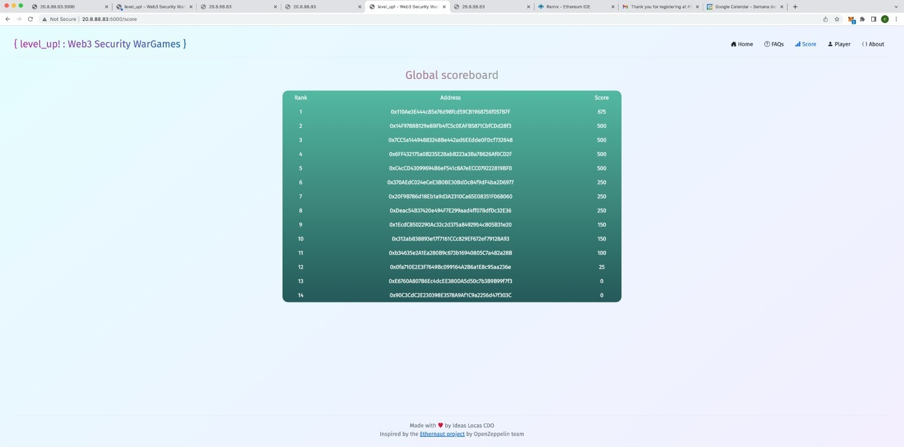

# LevelUp Telefonica

_____________________________________
 Bootcamp Cybersecurity | 42 Málaga
 
      l   e   v   e   l   U   P
_____________________________________

Smart Contract Development with Solidity: Proficient in designing, coding, and deploying smart contracts using Solidity, a programming language specifically tailored for Ethereum blockchain applications. Experienced in creating decentralized applications (DApps) and implementing secure and efficient blockchain-based solutions.

  

  

  

May 2023
