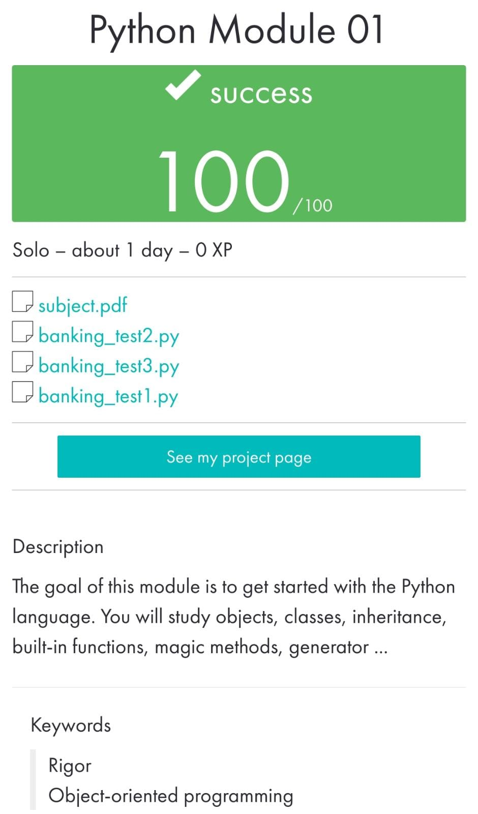

 ](https://img.shields.io/badge/python-3.9%20%7C%203.10-blue)

#     Python_Module_01

_____________________________________
 Bootcamp Cybersecurity | 42 Málaga
 
   p y t h o n . M o d u l e  01
_____________________________________

Exercise 00
The goal of the exercise is to get you familiar with the notions of classes and the manipulation of the objects related to those classes.

Exercise 01
The goal of the exercise is to tackle the notion inheritance of class.

Exercise 02
The goal of the exercise is to get you used with built-in methods, more particularly with those allowing to perform operations. Student is expected to code built-in methods for vector-vector and vector-scalar operations as rigorously as possible.

Exercise 03
The goal of the exercise is to discover the concept of generator object in Python.

Exercise 04
The goal of the exercise is to discover 2 useful methods for lists, tuples, dictionnaries (iterable class objects more generally) named zip and enumerate.

Exercise 05
The goals of this exercise is to discover new built-in functions and deepen your class manipulation and to be aware of possibility to modify instanced objects.
In this exercise you learn how to modify or add attributes to an object.

  

Jun 2023
