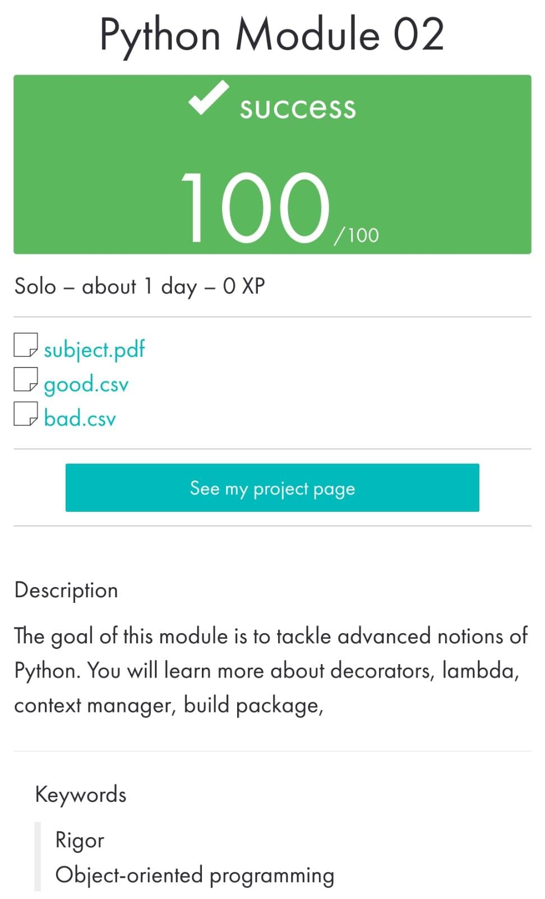

 ](https://img.shields.io/badge/python-3.9%20%7C%203.10-blue)

#     Python_Module_02

_____________________________________
 Bootcamp Cybersecurity | 42 Málaga
 
   p y t h o n . M o d u l e  02
_____________________________________

Exercise 00
The goal of the exercise is to work on the built-in functions map, filter and reduce.

Exercise 01
The goal of the exercise is to discover and manipulate *args and **kwargs arguments.

Exercise 02
Decorators: The @log will write info about the decorated function in a machine.log file.

Exercise 03
The goal of this exercise is to implement a context manager as a class.

Exercise 04
The goal of the exercise is to learn how to build a package and understand the magnificence of PyPi.

Exercise 05
Initiation to very basic statistic notions.

  

Jun 2023
