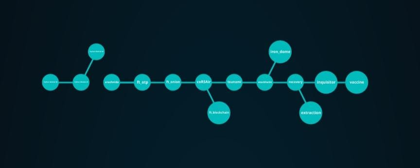

# BootCamp Cybersecurity

42 Málaga Fundación Telefónica

From April 11th to June 16nd, I had the opportunity to participate in a training program in cybersecurity. Additionally, in this bootcamp organized by Fundación Telefónica in collaboration with Telefónica Tech, I acquired basic knowledge of Python, the most popular programming language at the moment.

Over the course of 10 weeks, I was able to learn competencies in areas such as cryptography, network security, secure development and protection, web security, vulnerabilities, computer forensics, malware and malicious codes, OSINT techniques and metadata, and open-source intelligence research, among others.

  

## Progress

|  Project Name | Subject                |       Score      |
|:-------------:|:--------------- |:----------------:|
|Python_Module_00| Get started with the Python language    |   **100** / 100  |
|Python_Module_01| Objects, classes, inheritance, built-in functions, generator   |   **** / 100  |
|Python_Module_02| Decorators, lambda, context manager and build package   |   **** / 100  |
|   arachnida   | Web Scrapping & EXIF data       |   **125** / 100  |
|   coRSAir   | Cryptography & Vulnerable Ciphers    |   **100** / 100  |
 |    ft_otp     | Time-based_one-time_password creation   |   **125** / 100   |
|   ft_onion    | Web server with Docker that shows a webpage on the Tor network     |   **125** / 100  |
|ft_blockchain   | Proof-of-work algorithm            |   **100** / 100  |
|    tsunami    | Buffer & stack overflows on Windows XP         |   **100** / 100  |
|   stockholm   | Program that simulates the WannaCry ransomware   |   **100** / 100  |
|   iron_dome   |  Daemon service to monitoring illegal activity on Linux |   **125** / 100  |
|  recovery|  Recovery system info on Windows 10 |   **100** / 100  |
|  extraction|  In progress |   **** / 100  |
|  inquisitor|  ARP spoofing  |   **100** / 100  |
|  vaccine| SQL injection  |   **100** / 100  |

  

