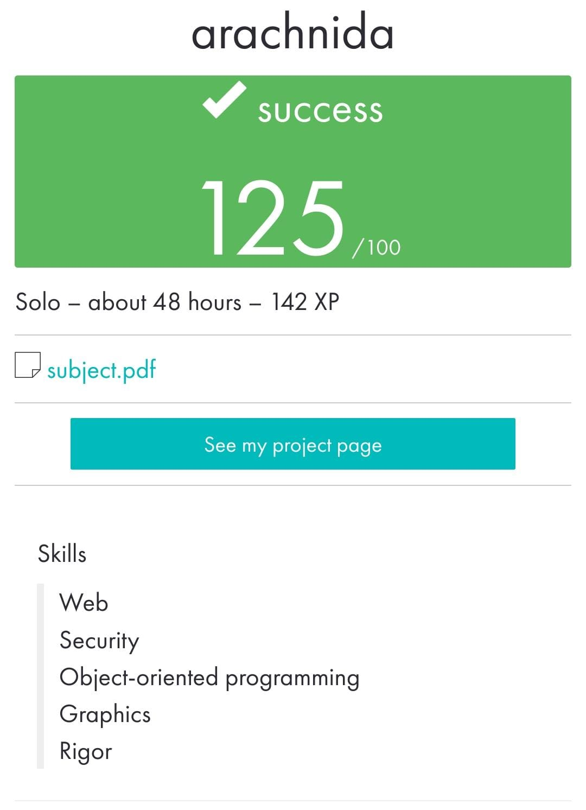

 ](https://img.shields.io/badge/python-3.9%20%7C%203.10-blue)
# arachnida

_____________________________________
 Bootcamp Cybersecurity | 42 Málaga
 
 a r a c h n i d a
_____________________________________

The **spider** program allow you to extract all the images from a website, recursively, by providing a url as a parameter. 
You manage the following program options:

```bash
  ./spider [-rlpS] URL
```

• Option -r : recursively downloads the images in a URL received as a parameter.

• Option -r -l [N] : indicates the maximum depth level of the recursive download.

If not indicated, it will be 5.

• Option -p [PATH] : indicates the path where the downloaded files will be saved.

If not specified, ```./data/``` will be used.


The **scorpion** program receive image files as parameters and to parse them for EXIF and other metadata, displaying them on the screen.
The program is compatible with the same extensions that spider handles. It displays basic attributes such as the creation date, as well as EXIF data.

```bash
  ./scorpion file
```

May 2023


<p align="center">  </p>
