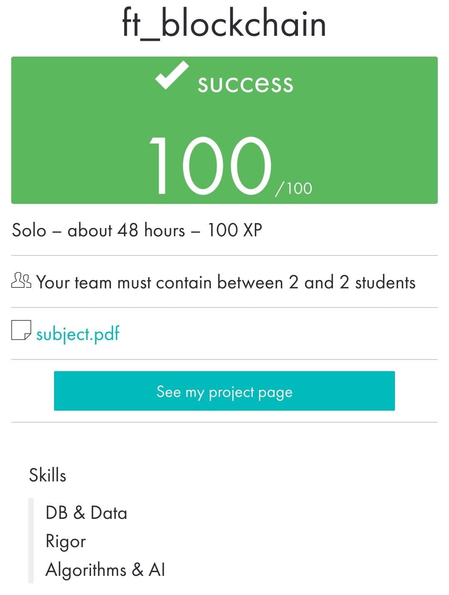

 ](https://img.shields.io/badge/python-3.9%20%7C%203.10-blue)
# ft_blockchain

____________________________________
 Bootcamp Cybersecurity | 42 Málaga
 
     f t _ b l o c k c h a i n
____________________________________

The workflow is to add different transactions to the current block and mine the block so
that the chain is added.
The proof-of-work algorithm is simple, for example, finding the number that, 
concatenated with the previous proof-of-work, matches the result of the SHA-256
hash ending in 4242. The chain of blocks is not persistent, it's stored in
the memory of the server but the server is not be connected to any specific database
software. When developing mining, three things are done:

• Calculate proof of work

• Reward miners (one transaction)

• Creation of the new block and add it to the chain

Once the blockchain is created, you can interact with it through different HTTP
requests on a text-based API:
```
    • [POST] /transactions/new : Post a new transaction to add to the next block.
    • [GET] /mine : Execute the proof of work and create a new block.
    • [GET] /chain : Returns information about the full blockchain (blocks, transactions, etc).
```
May 2023

<p align="center">  </p>
