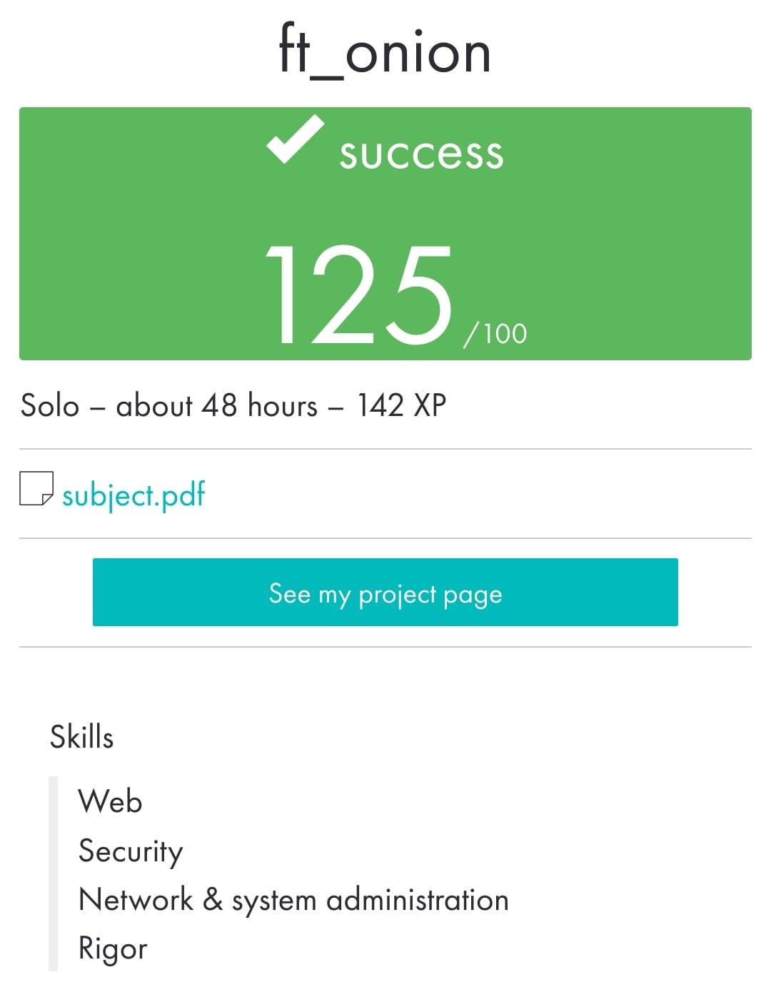

# ft_onion

_____________________________________
 Bootcamp Cybersecurity | 42 Málaga
 
       f  t  _  o  n  i  o  n
_____________________________________

A web server with Docker that shows a webpage on the Tor network.

• The service must have a static web page: a single index.html file. The page is accessible through a url of the type xxxxxxxxx.onion

• Nginx is used to configure the web server. 

• Access to the static page via HTTP on port 80 is enabled.

• Access to the server via SSH on port 4242 is enabled.

• No ports set in any firewall rules

Apr 2023

  

