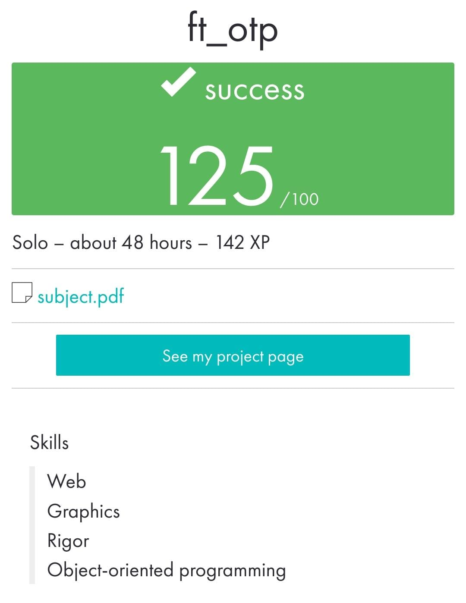

 ](https://img.shields.io/badge/python-3.9%20%7C%203.10-blue)
# ft_otp

_____________________________________
 Bootcamp Cybersecurity | 42 Málaga
 
         f  t  _  o  t  p
_____________________________________

A a program that allows you to register an initial password, and is capable of generating a new password each time it is requested, without use any library that facilitates the implementation of the algorithm, as long as they do not do the dirty work, that is, it is strictly forbidden to use any TOTP library.

• With the -g option, the program will receive as an argument a hexadecimal key
of at least 64 characters. The program will safely store this key in a file called
```bash
ft_otp.key
```
which will be encrypted.

• With the -k option, the program will generate a new temporary password and print it to standard output.

May 2023


<p align="center">  </p>
