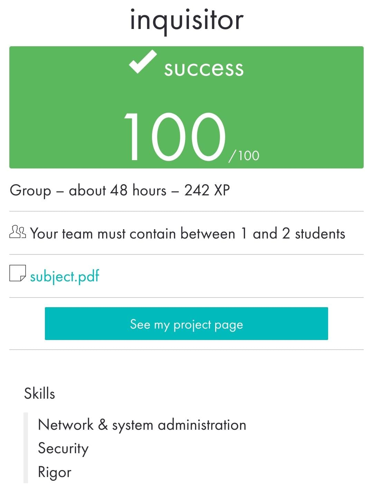

 ](https://img.shields.io/badge/python-3.9%20%7C%203.10-blue)
# inquisitor

_____________________________________
 Bootcamp Cybersecurity | 42 Málaga
 
   i  n  q  u  i  s  i  t  o  r
_____________________________________

A program called inquisitor with the following characteristics:

• Receive four parameters: <IP-src> <MAC-src> <IP-target> <MAC-target>

• Perform ARP poisoning in both directions (full duplex)

• When the attack is stopped (CTRL+C), the ARP tables will be restored.

• Only work with IPv4 addresses.

• The program intercept the traffic resulting from the login to an FTP server.

• The names of the files exchanged between the client and the FTP server are displayed in real time.

• The program never stop unexpectedly and will handle all input errors

 

  

 

May 2023
