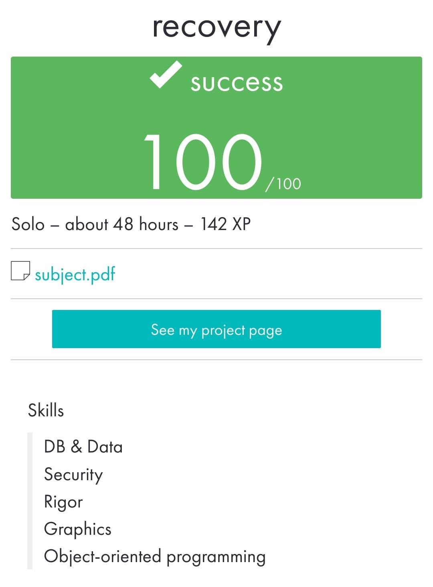

 ](https://img.shields.io/badge/python-3.9%20%7C%203.10-blue)
# recovery

_____________________________________
 Bootcamp Cybersecurity | 42 Málaga
 
       r  e  c  o  v  e  r  y
_____________________________________

A program that extracts the following artifacts on a given time lapse:

• Registry branches changes date (CurrentVersionRun)

• Recent used/opened files

• Temporal files

• Installed programs

• Processes on execution

• Web browser history (Edge, Chrome, Firefox)

• Connected devices

• Events logs

If the user does not give the program a time range, it reverts to a default value, in this case, last 4 hours

May 2023

  

