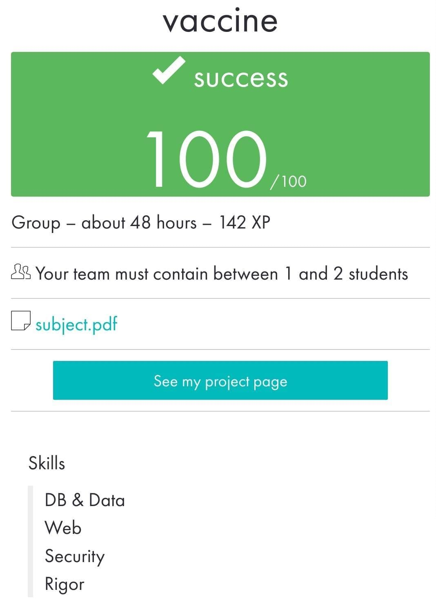

 ](https://img.shields.io/badge/python-3.9%20%7C%203.10-blue)
    # vaccine

_____________________________________
 Bootcamp Cybersecurity | 42 Málaga
 
     v   a   c   c   i   n   e
_____________________________________

## What this script does?
This script is a battery of tests to run against a given `URL` to be able to detect [SQL injection](https://en.wikipedia.org/wiki/SQL_injection) vulnerabilities. It detect type of database engine. The tests can be based on several types: union, error, boolean, time and even blind.

In case a website is confirmed to be vulnerable, the following can be obtained:
- The vulnerable parameters.
- The payload used.
- Database names.
- Table names.
- Column names.
- Complete database dump.

The data will be stored in a file.

It is also possible to perform a `SQL injection` by providing a `URL` as a parameter.

## What is SQL injection?
SQL Injection is the injection of SQL commands to alter the behaviour of a program and execute commands on the database. The impact SQL injection can have on a business is far reaching. A successful attack may result in the unauthorized viewing of user lists, the deletion of entire tables and, in certain cases, the attacker gaining administrative rights to a database, all of which are highly detrimental to a business.

## Arguments:
- Option -o : Archive file, if not specified it will be stored in a default one.
- Option -X : Type of request, if not specified GET will be used.
- Option -c : Login cookie if needed.
- Option -u : User-Agent, if not specified it will be a default one.
```bash
python3 vaccine.py [-oXcu] URL
```

## Bonus part:
- Wider range of database engines.
- Wider range of SQL injection methods.
- The tool allows you to edit various parameters of the request, e.g. the User-Agent.

## How to test it?
To test our script, we will use the [DVWA](https://hub.docker.com/r/vulnerables/web-dvwa) docker image. This image contains a vulnerable web application that we can use to test our script. The main problem is that we need to log in to the application to be able to test it. To do this, we will use login cookies passed as a parameter to the script.

Test with login cookie on DVWA docker image:
```bash
python3 vaccine.py -c "PHPSESSID=hpii9c33hv042qoms0mosrg0d7" http://127.0.0.1/vulnerabilities/sqli/
```

## What this script does?
This script is a battery of tests to run against a given `URL` to be able to detect [SQL injection](https://en.wikipedia.org/wiki/SQL_injection) vulnerabilities. It detect type of database engine. The tests can be based on several types: union, error, boolean, time and even blind.

In case a website is confirmed to be vulnerable, the following can be obtained:
- The vulnerable parameters.
- The payload used.
- Database names.
- Table names.
- Column names.
- Complete database dump.

The data will be stored in a file.

It is also possible to perform a `SQL injection` by providing a `URL` as a parameter.

## What is SQL injection?
SQL Injection is the injection of SQL commands to alter the behaviour of a program and execute commands on the database. The impact SQL injection can have on a business is far reaching. A successful attack may result in the unauthorized viewing of user lists, the deletion of entire tables and, in certain cases, the attacker gaining administrative rights to a database, all of which are highly detrimental to a business.

## Arguments:
- Option -o : Archive file, if not specified it will be stored in a default one.
- Option -X : Type of request, if not specified GET will be used.
- Option -c : Login cookie if needed.
- Option -u : User-Agent, if not specified it will be a default one.
```bash
python3 vaccine.py [-oXcu] URL
```

## Bonus part:
- Wider range of database engines.
- Wider range of SQL injection methods.
- The tool allows you to edit various parameters of the request, e.g. the User-Agent.

## How to test it?
To test our script, we will use the [DVWA](https://hub.docker.com/r/vulnerables/web-dvwa) docker image. This image contains a vulnerable web application that we can use to test our script. The main problem is that we need to log in to the application to be able to test it. To do this, we will use login cookies passed as a parameter to the script.

Test with login cookie on DVWA docker image:
```bash
python3 vaccine.py -c "PHPSESSID=hpii9c33hv042qoms0mosrg0d7" http://127.0.0.1/vulnerabilities/sqli/
```

May 2023

<p align="center">  </p>